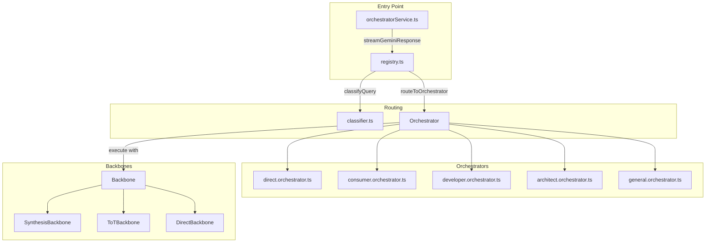

# Creating a New Persona (Orchestrator)

This document describes how to create a new persona (orchestrator) in the DeepThink clone codebase. A persona defines **who** the AI acts as, **what output format** it produces, and **how** it reasons through problems.

---

## Architecture Overview



---

## Step-by-Step: Creating a New Persona

### Step 1: Create the Orchestrator File

Create a new file at:

```
services/orchestrators/{persona}.orchestrator.ts
```

Example: `services/orchestrators/researcher.orchestrator.ts`

---

### Step 2: Define Your Prompts

Your persona must define prompts that implement either `SynthesisPrompts` or `ToTPrompts` from [types.ts](file:///home/hoang/node/gemini-3-pro-deepthink-clone/services/backbones/types.ts#L17-L45).

#### Required Prompt Functions

| Function     | Purpose                                    | Signature                                                         |
| ------------ | ------------------------------------------ | ----------------------------------------------------------------- |
| `divergence` | Generate multiple strategies/approaches    | `(query: string, context?: string) => string`                     |
| `critique`   | Evaluate a strategy's strengths/weaknesses | `(query: string, strategy: string, assumption: string) => string` |
| `synthesis`  | Combine strategies into master blueprint   | `(query: string, critiquedStrategies: unknown[]) => string`       |
| `final`      | Format the final user-facing output        | `(query: string, blueprint?: string) => string`                   |

#### Additional ToT Functions (if using Tree-of-Thought)

| Function        | Purpose                                  | Signature                                                                    |
| --------------- | ---------------------------------------- | ---------------------------------------------------------------------------- |
| `decomposition` | Decide if/how to break into sub-problems | `(query: string, depth: number, maxDepth: number, force: boolean) => string` |
| `aggregation`   | Combine child solutions                  | `(query: string, childSolutions: ChildSolutionInput[]) => string`            |

---

### Step 3: Implement the Orchestrator Object

```typescript
import { Orchestrator, OrchestratorContext, OrchestratorResult } from "./types";
import { ToTPrompts, Backbone } from "../backbones";

// 1. Define your prompts
const MY_PERSONA_PROMPTS: ToTPrompts = {
  divergence: (query: string, context?: string) => `...`,
  critique: (query: string, strategy: string, assumption: string) => `...`,
  synthesis: (query: string, strategies: unknown[]) => `...`,
  decomposition: (
    query: string,
    depth: number,
    maxDepth: number,
    force: boolean
  ) => `...`,
  aggregation: (
    query: string,
    childSolutions: { query: string; solution: string }[]
  ) => `...`,
  final: (query: string, blueprint?: string) => `...`,
};

// 2. Export the Orchestrator object
export const MyPersonaOrchestrator: Orchestrator = {
  // Unique identifier - used for routing
  id: "my-persona",

  // Human-readable name
  name: "My Persona Name",

  // Brief description for internal use
  description: "What this persona does",

  // Classification hint - THE LLM CLASSIFIER READS THIS
  classificationHint: `Use for specific use cases:
- "Trigger phrase 1...", "Trigger phrase 2..."
- Describes the type of user queries
- Keywords: keyword1, keyword2, keyword3`,

  // ToT decision hint - PERSONA-SPECIFIC LOGIC FOR WHEN TO USE TREE-OF-THOUGHT
  totDecisionHint: `Use ToT when this persona benefits from deep reasoning:
- NEEDS ToT when: [complex scenarios requiring decomposition]
- SKIP ToT when: [simple scenarios]
- Key indicator: [what triggers ToT for this persona]`,

  // Output format: "tsx" | "typescript" | "python" | "latex" | "markdown" | "json" | "auto"
  outputFormat: "markdown",

  // Your prompts object
  prompts: MY_PERSONA_PROMPTS,

  // Execute method - DO NOT MODIFY THIS PATTERN
  execute: async (
    query: string,
    _context: OrchestratorContext,
    backbone: Backbone
  ): Promise<OrchestratorResult> => {
    const result = await backbone.execute(
      query,
      {
        config: _context.config,
        onThinkingUpdate: _context.onThinkingUpdate,
        onToTUpdate: _context.onToTUpdate,
        onUsage: _context.onUsage,
      },
      MY_PERSONA_PROMPTS
    );

    return {
      prompt: result.prompt,
      outputFormat: "markdown", // Match your outputFormat above
      thinkingProcess: result.thinkingProcess,
      totProcess: result.totProcess,
    };
  },
};
```

---

### Step 4: Register in the Registry

Edit [registry.ts](file:///home/hoang/node/gemini-3-pro-deepthink-clone/services/orchestrators/registry.ts) to add your orchestrator:

```typescript
// 1. Import your orchestrator
import { MyPersonaOrchestrator } from "./my-persona.orchestrator";

// 2. Add to the orchestrators array (line ~41)
const orchestrators: Orchestrator[] = [
  DirectOrchestrator,
  ConsumerOrchestrator,
  DeveloperOrchestrator,
  ArchitectOrchestrator,
  GeneralOrchestrator,
  MyPersonaOrchestrator, // <-- Add here
];

// 3. Add to exports (line ~165)
export {
  DirectOrchestrator,
  ConsumerOrchestrator,
  DeveloperOrchestrator,
  ArchitectOrchestrator,
  GeneralOrchestrator,
  MyPersonaOrchestrator, // <-- Add here
};
```

---

## Critical Rules

> [!CAUTION] > **Violating these rules will break the system.**

### 1. Prompt Functions Must Return Valid Formats

| Function        | Required JSON Output Structure                                          |
| --------------- | ----------------------------------------------------------------------- |
| `divergence`    | `[{id, title, strategy, assumption}]`                                   |
| `critique`      | `{strengths, validity_conditions, invalidity_triggers, critical_flaws}` |
| `synthesis`     | `{blueprint, objective, tone, safeguards}`                              |
| `decomposition` | `{shouldDecompose, reasoning, subProblems: [{id, title, query}]}`       |
| `aggregation`   | `{aggregatedSolution, childContributions}`                              |

### 2. Classification Hint is Critical

The `classificationHint` field is **read by the LLM classifier** to decide when to route queries to your persona. Make it:

- Specific with trigger phrases
- Include relevant keywords
- Describe the user intent clearly

### 3. Output Format Must Match

The `outputFormat` in the orchestrator object **must match** the format returned in `execute()`.

### 4. Do Not Modify the Execute Pattern

The `execute` method follows a specific contract. Copy the pattern exactly from existing orchestrators.

---

## Existing Personas Reference

| ID          | Name                     | Output   | Use Case                                |
| ----------- | ------------------------ | -------- | --------------------------------------- |
| `direct`    | Direct Response          | auto     | Simple factual queries, greetings       |
| `consumer`  | Consumer App Builder     | tsx      | Non-technical users wanting visual apps |
| `developer` | Developer Code Generator | auto     | Technical users wanting production code |
| `architect` | System Architect         | markdown | System design, no code output           |
| `general`   | General Assistant        | markdown | Explanations, analysis, Q&A             |

---

## File Structure

```
services/
├── orchestratorService.ts    # Main entry point
├── geminiService.ts          # Gemini API wrapper
├── backbones/
│   ├── index.ts              # Backbone exports
│   ├── types.ts              # Prompt interfaces
│   ├── synthesis.backbone.ts # Diverge→Critique→Synthesize
│   └── tot.backbone.ts       # Tree-of-Thought
└── orchestrators/
    ├── types.ts              # Orchestrator interface
    ├── registry.ts           # Central registry + routing
    ├── classifier.ts         # LLM-based query classification
    ├── direct.orchestrator.ts
    ├── consumer.orchestrator.ts
    ├── developer.orchestrator.ts
    ├── architect.orchestrator.ts
    └── general.orchestrator.ts
```

---

## Complete Example: Researcher Persona

```typescript
/**
 * RESEARCHER ORCHESTRATOR
 *
 * For academic research and literature review tasks.
 * Outputs structured research summaries with citations.
 */

import { Orchestrator, OrchestratorContext, OrchestratorResult } from "./types";
import { ToTPrompts, Backbone } from "../backbones";

const RESEARCHER_PROMPTS: ToTPrompts = {
  divergence: (query: string, context?: string) => `
You are a Senior Research Analyst.

${context ? `CONTEXT: ${context}` : ""}
RESEARCH QUESTION: ${query}

Generate 3-5 distinct research perspectives:
- Different theoretical frameworks
- Various methodological approaches
- Alternative interpretations

Output format (JSON only):
[{"id": "h1", "title": "Perspective Name", "strategy": "Research approach...", "assumption": "Key assumption..."}]
`,

  critique: (query: string, strategy: string, assumption: string) => `
Evaluate this research perspective.

Research Question: "${query}"
Perspective: "${strategy}"
Assumption: "${assumption}"

Analyze:
1. Methodological rigor
2. Potential biases
3. Generalizability
4. Evidence requirements

Output format (JSON only):
{
  "strengths": ["strength 1", "strength 2"],
  "validity_conditions": "When this perspective is valid",
  "invalidity_triggers": ["limitation 1", "limitation 2"],
  "critical_flaws": "Summary of concerns"
}
`,

  synthesis: (query: string, strategies: unknown[]) => `
Synthesize these research perspectives into a comprehensive framework.

Research Question: "${query}"
Perspectives & Critiques: ${JSON.stringify(strategies)}

Create an integrated research approach.

Output format (JSON only):
{
  "blueprint": "Integrated research framework...",
  "objective": "Research goals...",
  "tone": "Academic, rigorous...",
  "safeguards": ["Bias mitigation", "Validation steps"]
}
`,

  decomposition: (
    query: string,
    depth: number,
    maxDepth: number,
    force: boolean
  ) => `
Should this research question be decomposed?

QUESTION: "${query}"
Current Depth: ${depth}, Max Depth: ${maxDepth}

${
  force && depth === 0
    ? "**FORCED MODE**: Break into research sub-questions."
    : ""
}

Output format (JSON only):
{
  "shouldDecompose": boolean,
  "reasoning": "Why decompose or not",
  "subProblems": [{"id": "sp1", "title": "Sub-topic", "query": "Sub-question"}]
}
`,

  aggregation: (
    query: string,
    childSolutions: { query: string; solution: string }[]
  ) => `
Integrate these research findings.

ORIGINAL QUESTION: "${query}"

FINDINGS:
${childSolutions
  .map((c, i) => `### Finding ${i + 1}: ${c.query}\n${c.solution}`)
  .join("\n---\n")}

Output format (JSON only):
{
  "aggregatedSolution": "Integrated findings...",
  "childContributions": ["Each finding's contribution"]
}
`,

  final: (query: string, blueprint?: string) => `
${blueprint ? `## Research Framework\n${blueprint}\n\n---\n` : ""}
## Research Question
${query}

## OUTPUT REQUIREMENTS

Provide a structured academic response:

### 1. Executive Summary
Key findings in 2-3 sentences.

### 2. Background & Literature
Relevant context and prior work.

### 3. Analysis
Systematic examination of the question.

### 4. Findings
Key discoveries and insights.

### 5. Implications
What this means for theory/practice.

### 6. Limitations & Future Directions
Caveats and next steps.

Use proper academic tone. Cite sources where applicable.
`,
};

export const ResearcherOrchestrator: Orchestrator = {
  id: "researcher",
  name: "Research Analyst",
  description: "Structured academic research and literature review",

  classificationHint: `Use for academic and research queries:
- "Research...", "Literature review...", "What does the research say..."
- Academic or scholarly language
- Asks for evidence-based analysis
- Keywords: research, study, literature, academic, evidence, analysis, methodology`,

  totDecisionHint: `Use ToT for complex research questions:
- NEEDS ToT when: Multi-disciplinary analysis, literature synthesis, requires multiple methodologies
- SKIP ToT when: Simple definition lookup, single-source query, straightforward factual research
- Key indicator: Does the question require synthesizing multiple research perspectives?`,

  outputFormat: "markdown",
  prompts: RESEARCHER_PROMPTS,

  execute: async (
    query: string,
    _context: OrchestratorContext,
    backbone: Backbone
  ): Promise<OrchestratorResult> => {
    const result = await backbone.execute(
      query,
      {
        config: _context.config,
        onThinkingUpdate: _context.onThinkingUpdate,
        onToTUpdate: _context.onToTUpdate,
        onUsage: _context.onUsage,
      },
      RESEARCHER_PROMPTS
    );

    return {
      prompt: result.prompt,
      outputFormat: "markdown",
      thinkingProcess: result.thinkingProcess,
      totProcess: result.totProcess,
    };
  },
};
```

---

## Verification Checklist

- [ ] File created at `services/orchestrators/{name}.orchestrator.ts`
- [ ] All 6 prompt functions implemented (if using ToT) or 4 (if Synthesis only)
- [ ] `classificationHint` is descriptive with keywords
- [ ] `totDecisionHint` defines persona-specific ToT logic
- [ ] `outputFormat` matches return in `execute()`
- [ ] Imported and added to `registry.ts` orchestrators array
- [ ] Added to `registry.ts` exports
- [ ] TypeScript compiles without errors
